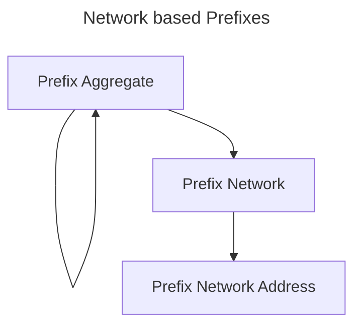
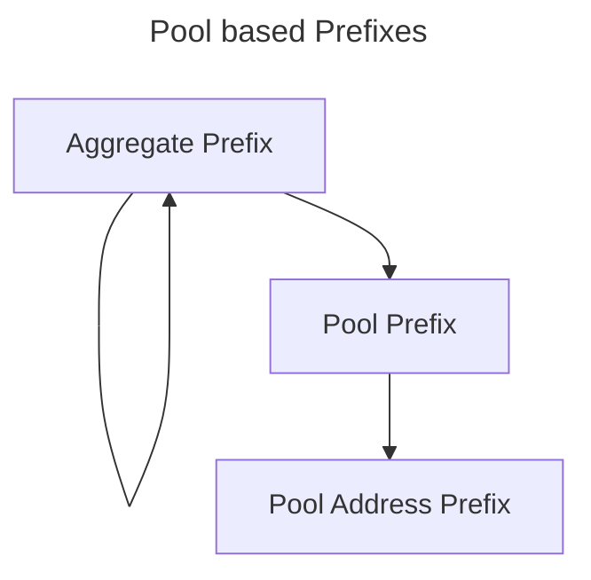

# IPAM

## IP Hierarchy

```mermaid
---
title: Network based Prefixes
---
flowchart TD
    a[Prefix Aggregate] --> a[Prefix Aggregate]
    a[Prefix Aggregate] --> n[Prefix Network]
    n[Prefix Network] --> addr[Prefix Network Address]
```

```mermaid
---
title: Pool based Prefixes
---
flowchart TD
    a[Aggregate Prefix] --> a[Aggregate Prefix]
    a[Aggregate Prefix] --> n[Pool Prefix]
    n[Pool Prefix] --> addr[Pool Address Prefix]
```